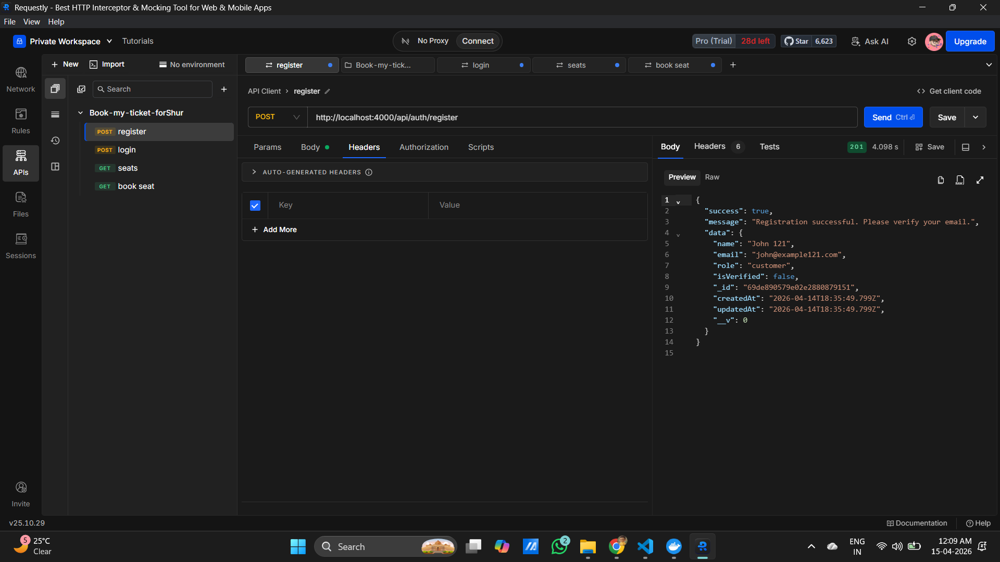
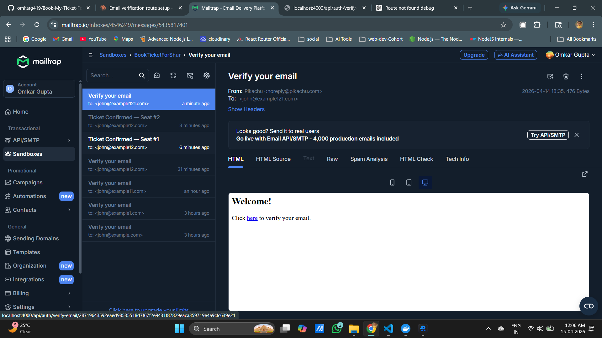
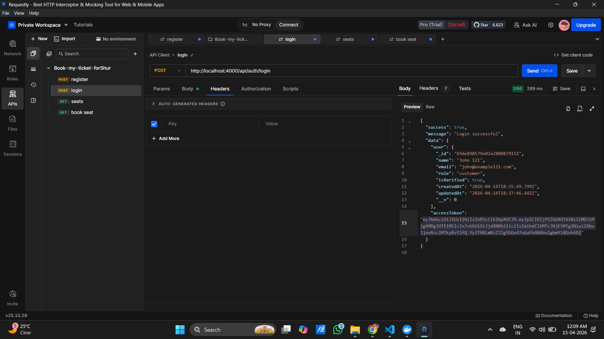
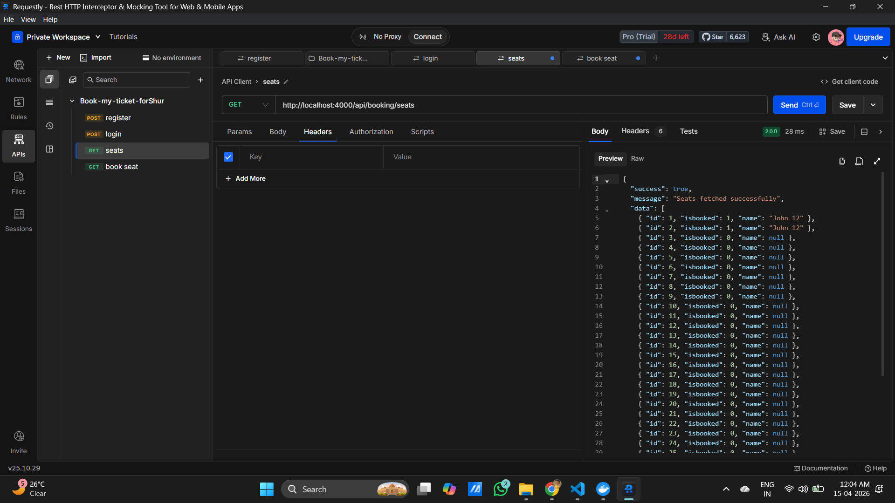
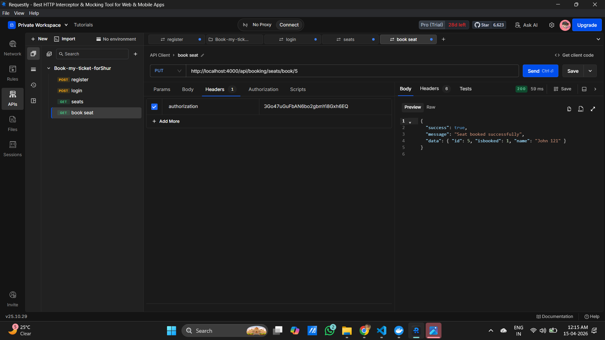
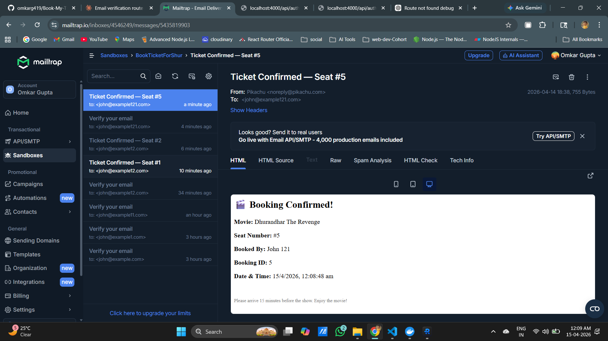
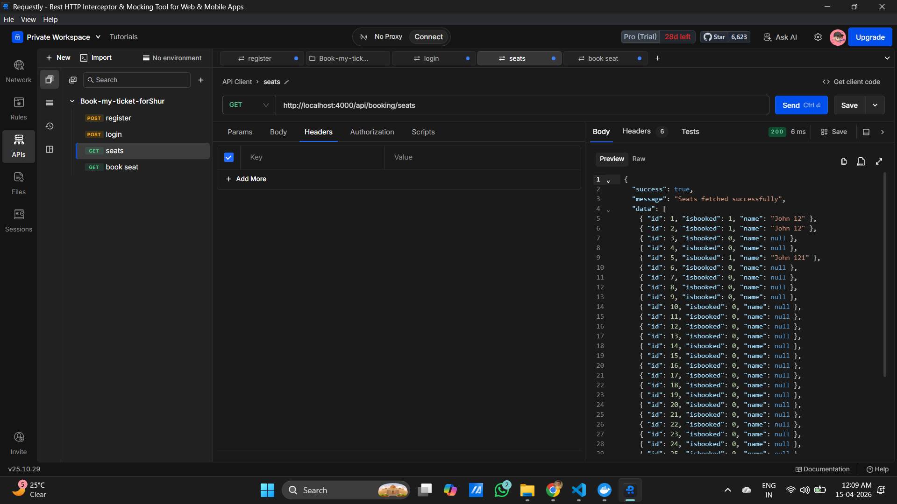

# 🎬 Book-My-Ticket-ForShur
 
> A secure, movie ticket booking REST API built with **Node.js**, **Express**, **PostgreSQL**, and **MongoDB** — featuring JWT-based authentication, seat reservation with transactional safety, and email notifications.
 
---

## Overview
 
**Book-My-Ticket-ForShur** is a backend REST API that powers a movie ticket booking system with a strong emphasis on **security**, **data integrity**, and **reliability**. The system ensures that only authenticated and authorized users can reserve seats, and leverages transactional database logic to prevent double-bookings — even under concurrent access.
 
The project uses a **dual-database architecture**:
- **MongoDB** (via Mongoose) — for storing user accounts and authentication data
- **PostgreSQL** (via `pg`) — for managing seat inventory and booking records
 
---

## 🏗 Architecture
 
```
┌──────────────────────────────────────────────────────┐
│                  Client (Browser)                     │
│         Vanilla JS + Tailwind CSS Frontend            │
└────────────────────┬─────────────────────────────────┘
                     │ HTTP  (JWT in Authorization header)
                     ▼
┌──────────────────────────────────────────────────────┐
│              Express.js Server (Node.js)             │
│                                                      │
│  ┌───────────────────┐   ┌────────────────────────┐  │
│  │   Auth Module     │   │    Booking Module       │ │
│  │  /api/auth/*      │   │  /api/seats             │ │
│  │                   │   │  /api/seats/book/:id    │ │
│  │  • Register       │   │                         │ │
│  │  • Login          │   │                         │ │
│  │  • Verify Email   │   └──────────┬──────────────┘ │
│  │  • Forgot/Reset   │              │                 │
│  │  • Refresh Token  │              │                 │
│  │  • Logout / Me    │              │                 │
│  └─────────┬─────────┘              │                 │
└────────────┼─────────────────────── ┼──────────────────┘
             │                        │
             ▼                        ▼
   ┌──────────────────┐      ┌───────────────────────┐
   │    MongoDB        │    │      PostgreSQL         │
   │ (User Identity)   │    │     (Seats)             │
   │                   │    │                         │
   │  • name           │    │    seats table          │
   │  • email          │    │                         │
   │  • password hash  │    │                         │
   │  • role           │    │                         │
   │  • isVerified     │    │                         │
   │  • refreshToken   │    │                         │
   │  • resetToken     │    │                         │
   └───────────────────┘    └─────────────────────────┘
```
---

## Tech Stack
 
| Layer | Technology |
|---|---|
| Runtime | Node.js (ESM modules) |
| Framework | Express.js v5 |
| Auth | JSON Web Tokens (JWT) + HTTP-only Cookies |
| User DB | MongoDB 8.0 + Mongoose |
| Booking DB | PostgreSQL 16 + `pg` (node-postgres) |
| Validation | Joi |
| Password Hashing | bcryptjs |
| Email | Nodemailer |
| Dev Server | Nodemon |
| Containerization | Docker + Docker Compose |
 
---

## ✨ Features
 
### 🔐 Authentication (MongoDB)
- ✅ User registration with name, email, password, and optional role
- ✅ Email verification via SHA-256 hashed token sent through SMTP
- ✅ Login is blocked until the email is verified
- ✅ Short-lived **access tokens** (JWT, 15 min) returned in response body
- ✅ Long-lived **refresh tokens** (JWT, 7 days) stored in `httpOnly` cookie
- ✅ Refresh tokens hashed before DB storage — invalidated on logout
- ✅ Silent token refresh via `/api/auth/refresh-token`
- ✅ Forgot password and reset password flow (15-minute expiring hashed token)
- ✅ Role-based access control (`customer`,`admin`, `support`)
- ✅ Joi DTO validation on every incoming request body
 
### 🎟 Booking (PostgreSQL)
- ✅ View all 32 seats with live availability and booker name tooltips
- ✅ Book a seat — authenticated users only
- ✅ `BEGIN → SELECT FOR UPDATE → UPDATE → INSERT → COMMIT` prevents double-booking
- ✅ Automatic `ROLLBACK` on any mid-transaction failure
- ✅ Ticket confirmation email dispatched after every successful booking

---

## API Endpoints
 
### Auth Routes — `/api/auth`
 
| Method | Endpoint | Access | Description |
|---|---|---|---|
| `POST` | `/api/auth/register` | Public | Register a new user |
| `POST` | `/api/auth/login` | Public | Login and receive JWT cookie |
| `POST` | `/api/auth/logout` | Protected | Clear auth cookie |
 
#### `POST /api/auth/register`
```json
// Request Body
{
  "name": "John Doe",
  "email": "john@example.com",
  "password": "StrongPassword@123"
}
 
// Response 201
{
  "message": "User registered successfully"
}
```
 
#### `POST /api/auth/login`
```json
// Request Body
{
  "email": "john@example.com",
  "password": "StrongPassword@123"
}
 
// Response 200 — Sets HTTP-only cookie with JWT
{
  "message": "Login successful",
  "user": { "name": "John Doe", "email": "john@example.com" }
}
```
 
---
 
### Seat Routes — `/api/seats`
 
> 🔐 All seat routes require a valid JWT cookie (protected).
 
| Method | Endpoint | Access | Description |
|---|---|---|---|
| `GET` | `/api/seats` | Protected | Fetch all 32 seats with availability status |
| `POST` | `/api/seats/book/:seatId` | Protected | Book an available seat |
 
---

## Environment Variables
 
Create a `.env` file in the root of the project:
 
```env
# Server
PORT=3000
NODE_ENV=development
 
# JWT
JWT_ACCESS_SECRET=your_super_secret_jwt_key
JWT_ACCESS_EXPIRES_IN=15m
JWT_REFRESH_SECRET=somthing
JWT_REFRESH_EXPIRES_IN=7d
 
# MongoDB
MONGO_URI=mongodb://localhost:27017/bookmyticket
MONGO_USERNAME=root
MONGO_PASSWORD=your_mongo_password
 
# PostgreSQL
PG_USER=postgres
PG_PASSWORD=your_pg_password
PG_HOST=localhost
PG_PORT=5432
PG_DATABASE=bookmyticket
 
# Email (Nodemailer)
EMAIL_HOST=smtp.gmail.com
EMAIL_PORT=587
EMAIL_USER=your_email@gmail.com
EMAIL_PASS=your_app_password
```
 
> ⚠️ Never commit your `.env` file. It is already included in `.gitignore`.
 
---

### Prerequisites
 
Make sure you have the following installed:
 
- [Node.js](https://nodejs.org/) `v18+`
- [npm](https://www.npmjs.com/) `v9+`
- [Docker](https://www.docker.com/) & [Docker Compose](https://docs.docker.com/compose/) (for databases)
 
---

### Installation
 
```bash
# 1. Clone the repository
git clone https://github.com/omkarg419/Book-My-Ticket-ForShur.git
 
# 2. Navigate into the project
cd Book-My-Ticket-ForShur
 
# 3. Install dependencies
npm install
 
# 4. Create your environment file
cp .env.example .env
# Then fill in your values in .env
```
 
---

### Running the App
 
**Step 1 — Start the databases with Docker:**
```bash
npm run db:up
```
 
**Step 2 — Initialize PostgreSQL schema (first time only):**
```bash
# Connect to the running postgres container and run the SQL schema
docker exec -i postgres psql -U <PG_USER> -d <PG_DATABASE> < bookTicketSchema.sql
```
 
**Step 3 — Start the server:**
```bash
# Development (with hot-reload via nodemon)
npm run dev
 
# Production
npm start
```
 
The server will be available at `http://localhost:3000`.
 
---

## Docker Setup
 
The `docker-compose.yml` spins up both databases with persistent volumes:
 
```yaml
services:
  mongodb:
    image: mongo:8.0
    ports: ["27017:27017"]
    environment:
      MONGO_INITDB_ROOT_USERNAME: ${MONGO_USERNAME}
      MONGO_INITDB_ROOT_PASSWORD: ${MONGO_PASSWORD}
    volumes:
      - mongo_data:/data/db
 
  postgres:
    image: postgres:16-alpine
    ports: ["5432:5432"]
    environment:
      POSTGRES_USER: ${PG_USER}
      POSTGRES_PASSWORD: ${PG_PASSWORD}
      POSTGRES_DB: ${PG_DATABASE}
    volumes:
      - pg_data:/var/lib/postgresql/data
```
 
| Command | Description |
|---|---|
| `npm run db:up` | Start MongoDB + PostgreSQL in background |
| `npm run db:down` | Stop and remove containers |
 
---

## Scripts
 
Defined in `package.json`:
 
| Script | Command | Description |
|---|---|---|
| `start` | `node server.js` | Start in production mode |
| `dev` | `nodemon server.js` | Start with live-reload |
| `db:up` | `docker compose up -d` | Launch DB containers |
| `db:down` | `docker compose down` | Stop DB containers |
 
---

## Dependencies
 
### Production
 
| Package | Version | Purpose |
|---|---|---|
| `express` | ^5.2.1 | Web framework |
| `mongoose` | ^9.4.1 | MongoDB ODM |
| `pg` | ^8.20.0 | PostgreSQL client |
| `jsonwebtoken` | ^9.0.3 | JWT auth |
| `bcryptjs` | ^3.0.3 | Password hashing |
| `cookie-parser` | ^1.4.7 | Parse HTTP cookies |
| `dotenv` | ^17.4.2 | Environment config |
| `joi` | ^18.1.2 | Input validation |
| `nodemailer` | ^8.0.5 | Email sending |
 
### Development
 
| Package | Version | Purpose |
|---|---|---|
| `nodemon` | ^3.1.14 | Auto-restart on file change |
 
---
## API Output Screenshots
### 🔐 Authentication APIs


##### /api/auth/register (📌 Register User)


##### 📩 Email Verification (Mailtrap)

After registration, user receives a verification email via Mailtrap.


##### /api/auth/login (🔑 Login User)


### 🎟️ Booking APIs
##### /api/booking/seats (💺 Check empty seats)


##### /api/booking/seats/book/:seatId (🪑 Seat booking)


##### 📧 Confirmation Email
After successful booking, a confirmation email is sent to the user.



##### /api/booking/seats  (🪑 Seat booking after)

---

## 👨‍💻 Author
 
**Omkar Gupta** — [@omkarg419](https://github.com/omkarg419)
 